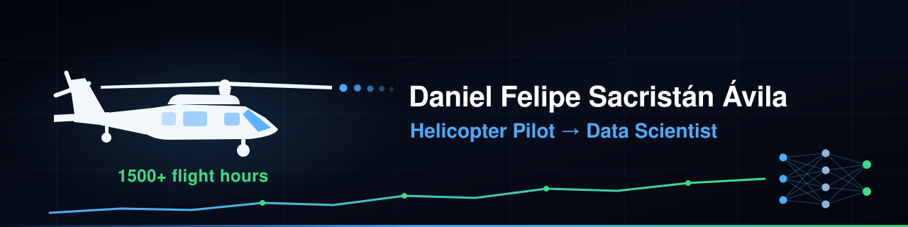

**MSc Data Science candidate · Esp. Machine Learning**

🌎 Spanish (native) · English (B2 · professional working proficiency) 

---

### 🌐 My Portfolio

 

### 🎯 About me · 📫 Let's connect:  

Colombian Air Force captain (UH-60 Black Hawk copilot / UH-1 pilot) transitioning into **data science**. I discovered data while recovering from a stroke — building dashboards to track my own rehabilitation — and turned it into a career path. I bring cockpit discipline to data work: reproducible pipelines, statistical rigor, and clear communication.

### 🚀 What I'm working on

| | Project | What it does | Stack | Status | Links |
|:--:|---|---|---|:--:|---|
| 🏋️ | **rehab-strength** | Health-analytics dashboard tracking workouts, sleep & recovery after a stroke — full data pipeline, statistical testing and CI | `Python` `Streamlit` `Pandas` |  | **[Live app »](https://rehab-strength.streamlit.app)** · [Repo](https://github.com/POLUX89/rehab-strength) |
| 📰 | **NLP-Fake-News-Colombia** | Spanish NLP classifying news verdicts (true / false / uncertain) from Colombian fact-checks — web-scraped dataset, BETO fine-tuning, model card · datasheet · data statement | `Transformers` `BETO` `Streamlit` |  | **[Live demo »](https://beto-colombiacheck.streamlit.app/)** · [Repo](https://github.com/POLUX89/NLP-Fake-News-Colombia) |
| ⚡ | **Forecast-Energy-StockChange-Colombia** | Forecasting Colombia's hourly wholesale electricity spot price (*precio de bolsa*) from public SIMEM/XM data — self-updating ingestion pipeline on GitHub Actions | `Python` `Time series` `GitHub Actions` |  | [Repo](https://github.com/POLUX89/Forecast-Energy-StockChange-Colombia) |
| 🚁 | **ASRS Rotorcraft NLP** | **MSc thesis** — taxonomic coverage of NASA ASRS incident narratives in rotorcraft operations. Domain expertise from 1500+ flight hours applied to model auditing and disaggregated evaluation | `Python` `NLP` `Transformers` |  | *private until defense* |

### 🛠️ Tech & Tools

---

### 🎛️ Stats

---

From flight plans to data pipelines — precision, discipline and clear communication.

